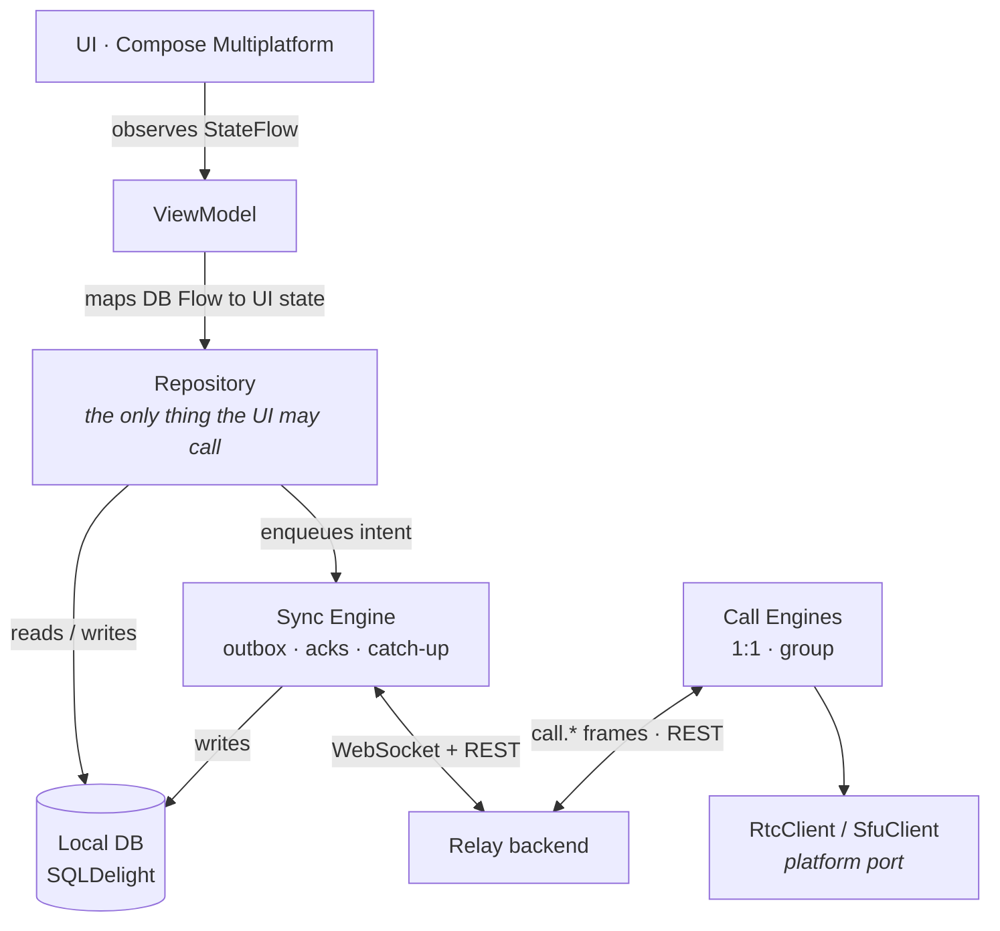

<div align="center">

# Relay Mobile

**An offline-first messenger for Android and iOS, built with Kotlin Multiplatform and Compose Multiplatform.**

Real-time chat, presence and typing, 1:1 and group audio calls, push notifications, and a sync engine that keeps every message safe even when the network is not.

[](https://kotlinlang.org)
[](https://www.jetbrains.com/compose-multiplatform/)
[](https://ktor.io)
[](https://sqldelight.github.io/sqldelight/)
[](https://insert-koin.io)
[](#android)
[](#ios)

[Features](#features) · [Architecture](#architecture) · [Getting started](#getting-started) · [Development](#development) · [Documentation](#documentation) · [Status](#status-and-roadmap)

</div>

---

## About

Relay Mobile is the native client of the **Relay** messenger. One Kotlin codebase holds the protocol layer, the local database, the sync engine, the call engines, and the entire Compose UI. Android and iOS add only what must be native: push delivery, WebRTC media, and app-lifecycle hooks.

The project is part of a three-repository system:

| Repository | Role |
|---|---|
| [`relay`](https://github.com/AntonPiekhotin/relay) | Backend. Kotlin / Spring microservices, Kafka, Keycloak, LiveKit SFU |
| [`relay-frontend`](https://github.com/AntonPiekhotin/relay-frontend) | Web client. React, TypeScript, Vite |
| **`relay-mobile`** (this repo) | Android and iOS client. Kotlin Multiplatform, Compose Multiplatform |

All three speak the same versioned wire protocol, documented in [`docs/PROTOCOL.md`](docs/PROTOCOL.md).

## Features

| | Feature | Notes |
|---|---|---|
| ✅ | **Direct and group chats** | Dialog list, chat screen, composer, system rows, group creation |
| ✅ | **Offline-first messaging** | Every send lands in a local outbox first, renders instantly, and survives app death |
| ✅ | **Idempotent delivery** | A client-generated `clientMsgId` per message. Retries never create duplicates |
| ✅ | **Reconnect and catch-up** | Exponential backoff, per-dialog sync cursors, REST catch-up after every reconnect |
| ✅ | **Read receipts** | Sending / sent / read / failed status derived from the database, never held in memory |
| ✅ | **Presence and typing** | Online, last seen, typing indicator. Subscribed on demand per open chat |
| ✅ | **People and contacts** | User search, contact list, profile screen |
| ✅ | **1:1 audio calls** | Signaling over the WebSocket, media peer-to-peer over WebRTC |
| ✅ | **Group audio calls** | REST-driven control, media through a LiveKit SFU |
| ✅ | **Call history** | Calls tab backed by the call-log endpoint |
| ✅ | **Push notifications (Android)** | FCM, verified end to end. A push is a hint, the client still catches up over REST |
| 🟡 | **Push notifications (iOS)** | Fully scaffolded, blocked on the `aps-environment` entitlement. See [`docs/IOS.md`](docs/IOS.md) §1 |
| 🟡 | **Background calls** | Foreground only. No CallKit or ConnectionService yet |

<!--
Screenshots go here once captured, e.g.:
<p align="center">
  
  
  
</p>
-->

## Architecture

### The governing idea

**The local database is the source of truth. The network is a fast path.**

The UI observes SQLDelight and nothing else. The network layer writes to the database and nothing else. Offline behaviour is not a feature bolted on later. It is the default, because the UI never knew about the network to begin with. This is also what makes iOS bearable: the socket dies on every background transition, and the UI never notices.



### How a message travels

1. The composer calls `send()`. A UUID is minted **before anything else happens**.
2. The message is written to the outbox as `PENDING`. The chat screen renders it immediately.
3. The sync engine flushes the outbox over the WebSocket.
4. The server acks with the same `clientMsgId`. The row is promoted to `SENT` and gains a server id.
5. A timeout schedules a retry **with the same id**. A permanent error marks it `FAILED` with a retry affordance.
6. On every reconnect the engine catches up over REST from the per-dialog cursor, so anything the socket missed still arrives.

### Layering

| Layer | Package | May depend on | Must never |
|---|---|---|---|
| UI | `ui/` | `repository`, `di` | Touch `network`, `db`, or `sync` directly |
| Repository | `repository/` | `db`, `sync` | Leak Ktor or SQLDelight types |
| Sync | `sync/`, `presence/`, `push/` | `network`, `db`, `protocol` | Know anything about the UI |
| Calls | `call/` | `network`, `protocol` | Hold media code or touch the UI |
| Network | `network/` | `protocol` | Write to the DB |
| Database | `db/` | nothing | Depend on anything above it |
| Protocol | `protocol/` | nothing | Depend on anything |

### Invariants the code defends

- Every outgoing message gets a **client-generated UUID** before any other work. Retries reuse it.
- **Writes hit the outbox before any network call.** The message must survive app death.
- **The socket is never a guarantee.** REST catch-up is the correctness mechanism.
- **No platform code in `commonMain`.** Platform implementations are injected through Koin.
- **No blocking calls in coroutines.** No `runBlocking` outside tests.
- **Tokens, message text, and user identifiers are never logged** at INFO or above.

## Tech stack

| Concern | Choice |
|---|---|
| Language | Kotlin 2.4, Kotlin Multiplatform |
| UI | Compose Multiplatform 1.11, Material 3, Navigation Compose, Lifecycle ViewModel |
| Networking | Ktor client 3.3 with OkHttp (Android) and Darwin (iOS) engines, WebSockets, kotlinx.serialization |
| Persistence | SQLDelight 2.1 with verified migrations, coroutine extensions |
| DI | Koin 4.1 |
| Concurrency | kotlinx.coroutines, kotlinx-datetime |
| Calls | stream-webrtc-android (Android) and stasel/WebRTC (iOS) for 1:1, LiveKit SDKs for group audio |
| Push | Firebase Cloud Messaging (Android), APNs scaffolding (iOS) |
| Secure storage | AndroidX Security Crypto (Android), Keychain (iOS) |
| Testing | kotlin-test, kotlinx-coroutines-test, Turbine, Compose UI test, in-memory SQLDelight |

## Project structure

```
relay-mobile/
├── shared/                       # Kotlin Multiplatform module, builds the Shared.framework for iOS
│   └── src/
│       ├── commonMain/kotlin/com/relay/
│       │   ├── protocol/         # envelope, frames, serialization
│       │   ├── network/          # Ktor HTTP + WebSocket clients
│       │   ├── db/               # SQLDelight DAOs and stores
│       │   ├── sync/             # sync engine, outbox, catch-up, read cursors
│       │   ├── presence/         # presence + typing (ephemeral, no DB)
│       │   ├── push/             # push coordinator, device-token registrar
│       │   ├── call/             # CallEngine, GroupCallEngine, platform ports
│       │   ├── repository/       # the UI-facing API
│       │   ├── auth/             # session, token storage, refresh
│       │   ├── ui/               # screens, components, navigation, theme
│       │   └── di/               # Koin modules
│       ├── commonMain/sqldelight/ # .sq tables, .sqm migrations, schema snapshots
│       ├── androidMain/          # FCM, WebRTC, LiveKit, encrypted prefs
│       ├── iosMain/              # Swift bridge, lifecycle, notification presenter
│       ├── commonTest/           # engine, repository, ViewModel tests
│       └── uiTest/               # Compose UI tests (Android device + iOS)
├── androidApp/                   # Android entry point, notification and call plumbing
├── iosApp/                       # Xcode project, SwiftUI entry, WebRTC and LiveKit glue
├── docs/                         # topic documentation, see below
└── CLAUDE.md                     # invariants and routing for humans and AI agents
```

## Getting started

### Prerequisites

| Tool | Version |
|---|---|
| macOS | Required for the iOS target. Android alone builds anywhere |
| JDK | 17 or newer |
| Android Studio | Latest stable, with the Kotlin Multiplatform plugin |
| Xcode | Latest stable, for iOS |
| Relay backend | Running locally or reachable over the network. See [`relay`](https://github.com/AntonPiekhotin/relay) |

Run JetBrains' [`kdoctor`](https://github.com/Kotlin/kdoctor) before debugging any environment issue. It catches most misconfiguration.

### Clone

```bash
git clone https://github.com/AntonPiekhotin/relay-mobile.git
cd relay-mobile
```

### Android

1. Add your Firebase project's `google-services.json` to `androidApp/` if you want push notifications. The build works without push, but FCM registration will fail at runtime.
2. Build and install:

```bash
./gradlew :androidApp:assembleDebug
./gradlew :androidApp:installDebug
```

The backend URLs for Android live in `shared/src/androidMain/kotlin/com/relay/di/Modules.android.kt`. Point them at your instance. Use `10.0.2.2` to reach a backend running on the emulator's host machine.

### iOS

1. Open `iosApp/iosApp.xcodeproj` in Xcode.
2. Select a simulator or a device and run. Gradle builds the shared framework as an Xcode build phase, so there is no manual step.

Backend URLs are read from `iosApp/iosApp/Info.plist`:

| Key | Purpose |
|---|---|
| `RelayApiBaseUrl` | Full REST base URL |
| `RelayWsUrl` | Full WebSocket URL |
| `RelayServerHost` | Fallback host used to derive both when the two keys above are absent |

On a physical device the backend must be reachable from the phone's network. Office networks with client isolation will block it, so a personal hotspot is often the simplest option.

## Development

### Commands

```bash
./gradlew :androidApp:assembleDebug                    # Android debug APK
./gradlew allTests                                     # common + platform unit tests
./gradlew :shared:iosSimulatorArm64Test                # iOS unit tests only
./gradlew :shared:check                                # tests + schema migration verification
./gradlew :shared:generateCommonMainRelayDbInterface   # regenerate DB code after .sq changes
./gradlew :shared:generateCommonMainRelayDbSchema      # refresh the schema snapshot after a migration
```

### Testing

The interesting logic is platform-independent and lives in `commonTest`: the sync engine, outbox, backoff, frame parsing and encoding, read cursors, both call engines, the presence engine, the push coordinator, and every ViewModel. Tests run against an in-memory SQLDelight database and fake sockets, so they are fast and deterministic. Compose UI tests live in `uiTest` and run on both an Android device and the iOS simulator.

### Changing the database schema

Editing a `.sq` file is never enough. The schema version is derived from the number of `.sqm` migration files, so a changed table with no new migration means existing installs never upgrade and crash on first query.

Every schema change needs three things:

1. The `.sq` edit.
2. A new `<n>.sqm` migrating from the previous version.
3. A regenerated snapshot in `shared/src/commonMain/sqldelight/databases/`.

`verifyMigrations` is on, so `./gradlew :shared:check` fails when they disagree. Note that `allTests` does **not** run that check.

### Conventions

- Read [`CLAUDE.md`](CLAUDE.md) first. It holds the invariants, the anti-patterns, and a routing table into the docs. It is written for AI coding agents but applies to humans equally.
- The wire protocol is shared with the backend. Never change an existing frame's shape. Add a new `type` or bump `v`, and update [`docs/PROTOCOL.md`](docs/PROTOCOL.md) in both repositories in the same change.
- Composables observe a `StateFlow` from a ViewModel. They never touch the network, the DB, or the sync engine.

## Documentation

| Document | Covers |
|---|---|
| [`docs/PROTOCOL.md`](docs/PROTOCOL.md) | Wire format, frames, REST endpoints, error codes. Mirrored in the backend repo |
| [`docs/ARCHITECTURE.md`](docs/ARCHITECTURE.md) | Layering, module layout, DI, concurrency, testing |
| [`docs/SYNC.md`](docs/SYNC.md) | Outbox, acks, catch-up, DB schema, offline behaviour. The hard part |
| [`docs/CALLS.md`](docs/CALLS.md) | Call signaling, WebRTC, LiveKit, the call state machine |
| [`docs/IOS.md`](docs/IOS.md) | iOS lifecycle, background constraints, push, Xcode |
| [`docs/ANDROID.md`](docs/ANDROID.md) | Foreground service, FCM, Doze, permissions |
| [`docs/UI.md`](docs/UI.md) | Compose conventions, state modelling, navigation, theming |
| [`docs/SETUP.md`](docs/SETUP.md) | Toolchain, Gradle, dependencies, build gotchas, CI |

## Status and roadmap

Built in phases, each depending on the previous one.

- [x] **Shared core.** Protocol models, Ktor WebSocket client, auth, connection to the gateway from both platforms
- [x] **Local DB and sync engine.** Outbox, ack handling, catch-up
- [x] **Compose UI.** Dialog list, chat, composer, theme, navigation, people search, contacts
- [x] **Push notifications.** Android done and verified. iOS scaffolded, blocked on a paid Apple Developer account
- [x] **Presence and typing.** Per-chat subscriptions, throttled typing sends, client-side expiry
- [x] **1:1 audio calls.** Signaling plus WebRTC media on both platforms
- [x] **Group audio calls.** REST-driven control, media through the LiveKit SFU
- [x] **Group chats.** Creation, server-provided titles, system messages, dialog deletion
- [ ] **iOS push and CallKit.** Waiting on the `aps-environment` entitlement
- [ ] **Background calls on Android.** ConnectionService integration
- [ ] **Group management UI.** Rename, members, leave, delete. Live server-side, no client screens yet

## Contributing

Issues and pull requests are welcome. Before opening one:

1. Read [`CLAUDE.md`](CLAUDE.md) and the docs matching the area you are touching.
2. Run `./gradlew :shared:check` and make sure it passes. It includes the schema migration check that `allTests` skips.
3. Keep the wire protocol backward compatible and mirror any protocol change in the backend repository.

## Acknowledgements

Built on [Kotlin Multiplatform](https://kotlinlang.org/docs/multiplatform.html), [Compose Multiplatform](https://www.jetbrains.com/compose-multiplatform/), [Ktor](https://ktor.io), [SQLDelight](https://sqldelight.github.io/sqldelight/), [Koin](https://insert-koin.io), [LiveKit](https://livekit.io), and [stream-webrtc-android](https://github.com/GetStream/webrtc-android).
